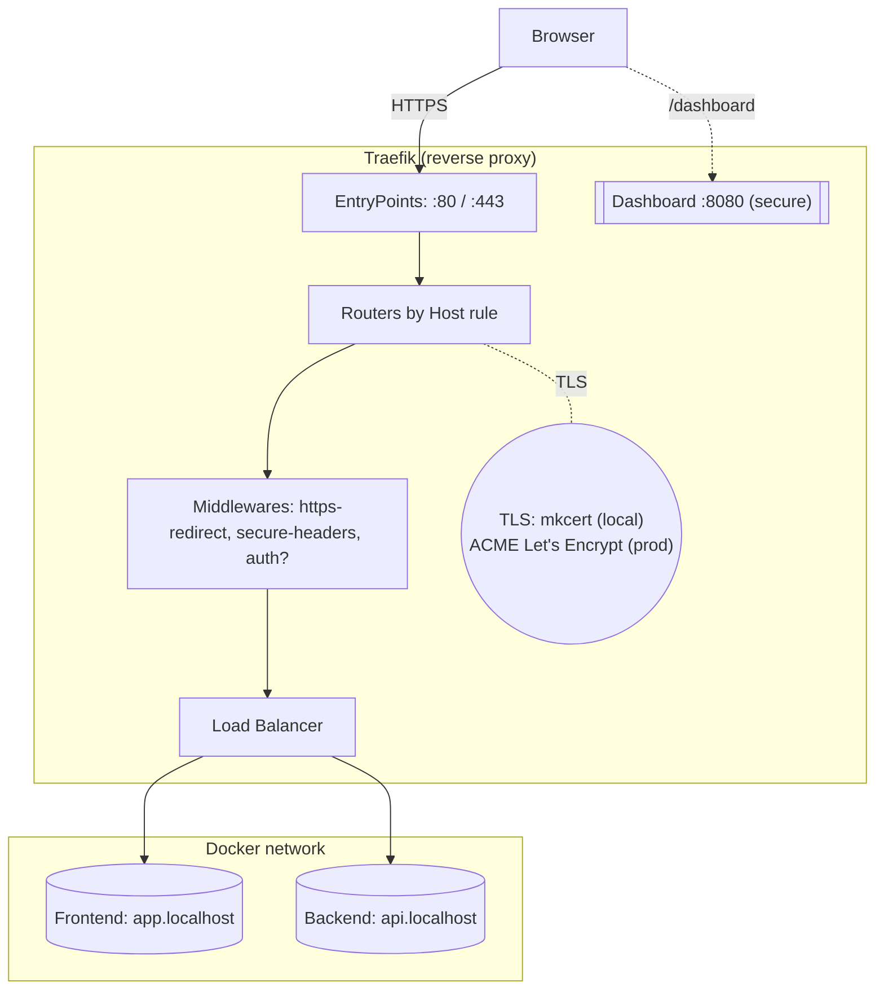
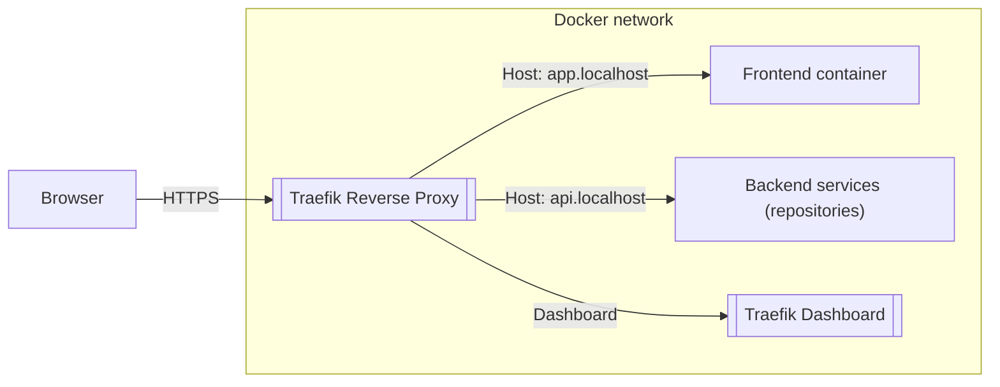

<p align="center">
  
</p>

# 🥷 Full-Stack Infrastructure Blueprint

**FROM LOCALHOST TO PRODUCTION — BUILT LIKE A HACKER**

<p align="center">
  <!-- Repo metrics -->
  <a href="https://github.com/leonobitech/fullstack-infrastructure-blueprint/stargazers">
    
  </a>
  <a href="https://github.com/leonobitech/fullstack-infrastructure-blueprint/network/members">
    
  </a>
  <a href="https://github.com/leonobitech/fullstack-infrastructure-blueprint/issues">
    
  </a>
  <a href="https://github.com/leonobitech/fullstack-infrastructure-blueprint/blob/main/LICENSE">
    
  </a>
  

  <br/>

  <!-- Tech badges -->
  <a href="https://www.docker.com/">
    
  </a>
  <a href="https://traefik.io/">
    
  </a>
  <a href="https://github.com/FiloSottile/mkcert">
    
  </a>
  
</p>

> 🧠 Leonobitech Hacker Stack is not a “hello world.” It’s a production-grade local infrastructure forged for real-world AI platforms, microservices, and automation backends — but deployable on your laptop.
>
> 🐳 Built with **Docker**, wired by **Traefik**, encrypted with **mkcert**, and designed to mirror the behavior of a VPS without ever leaving `localhost`.

---

## 🧠 Hacker Philosophy

> “Production is not a destination — it’s a state of mind.”

Most dev environments are fragile illusions: no HTTPS, no reverse proxy, no domain routing. Then deployment day arrives… and everything breaks.

This blueprint flips that script. It brings **production-like behavior to local development**:

- 🔐 HTTPS with trusted local certs
- ⚡ Traefik reverse proxy with TLS, routing & middleware
- 🐳 Container orchestration via Docker Compose
- 🌍 Host-based domain simulation
- 🧬 Drop-in extensibility for frontends, APIs, agents, and more

Use it as the **launchpad** for your next automation platform, SaaS product, or AI agent swarm.

---

## 🧱 Stack Components

| Layer                 | Component         | Purpose                             |
| --------------------- | ----------------- | ----------------------------------- |
| 🐳 **Docker Engine**  | Container runtime | Isolated, reproducible environments |
| ⚡ **Traefik 3.x**    | Reverse proxy     | Dynamic routing, TLS termination    |
| 🔐 **mkcert**         | HTTPS             | Trusted local certificates          |
| 🌐 **DNS Simulation** | `/etc/hosts`      | Realistic domain-based routing      |
| 🧠 **Dynamic Config** | Middlewares       | Security headers, redirects, auth   |

---

## 📁 Folder Structure

```
fullstack-infrastructure-blueprint/
├─ traefik/
│  ├─ traefik.yml                # Static config
│  ├─ dynamic/
│  │  ├─ middlewares.yml         # CSP, headers, etc.
│  │  └─ tls.yml                 # mkcert certs (local)
│  └─ certs/
│
├── repositories/                # future backend microservices
├── frontend/                    # future Next.js frontend
├── .env.example
├── .gitignore
├── docker-compose.local.yml     # mkcert override
├── docker-compose.prod.yml      # ACME override
├── docker-compose.yml           # Base stack
├── LICENSE
├── Makefile
└── README.md


```

---

## 🗺️ Architecture (Mermaid)

> We first bring up **only Traefik + HTTPS**. Frontend/backend come later in other repos.



---

This is the mental model we’ll reuse across repos (frontend/back will live elsewhere but connect here).



---

## 🛠️ Prerequisites

> **Read this flow top‑to‑bottom.** We’ll bring up **only Traefik + HTTPS** first. Overrides (local/prod) come **after** the first success.

This section is **fully step‑by‑step** so you can follow it verbatim. Nothing else needed outside the README.

## 🐳 Docker & Docker Compose — Setup

Before using this project, ensure Docker and Compose are installed.

### 📦 macOS (without Docker Desktop — lightweight via Colima)

> macOS doesn’t run Docker natively (no Linux kernel), so we use a lightweight Linux VM with **Colima**.

1. **Install tools:**

```bash
brew install colima docker docker-compose
```

2. **Add Compose plugin path:** (required for Homebrew installations)

```bash
mkdir -p ~/.docker
cat > ~/.docker/config.json << 'JSON'
{
  "cliPluginsExtraDirs": ["/opt/homebrew/lib/docker/cli-plugins"]
}
JSON
```

3. **Start Docker Engine via Colima:**

```bash
colima start --cpu 4 --memory 8 --disk 60
```

4. **Verify Docker is working:**

```bash
docker context use colima
docker version
docker compose version
```

5. **Smoke test container:**

```bash
docker run --rm -p 8081:80 traefik/whoami
# In a second terminal:
curl -s http://localhost:8081 | head -n 5
```

Stop with `Ctrl+C`.

---

### 🐧 Linux (Ubuntu/Debian) — Native Docker

1. **Install Docker Engine and Compose plugin:**

```bash
sudo apt-get update
sudo apt-get install -y ca-certificates curl gnupg
sudo install -m 0755 -d /etc/apt/keyrings
curl -fsSL https://download.docker.com/linux/ubuntu/gpg | sudo gpg --dearmor -o /etc/apt/keyrings/docker.gpg
echo \
  "deb [arch=$(dpkg --print-architecture) signed-by=/etc/apt/keyrings/docker.gpg] https://download.docker.com/linux/ubuntu \
  $(. /etc/os-release && echo $VERSION_CODENAME) stable" | \
  sudo tee /etc/apt/sources.list.d/docker.list > /dev/null
sudo apt-get update
sudo apt-get install -y docker-ce docker-ce-cli containerd.io docker-buildx-plugin docker-compose-plugin
sudo usermod -aG docker "$USER"  # log out/in to apply
```

2. **Verify installation:**

```bash
docker version
docker compose version
```

3. **Smoke test container:**

```bash
docker run --rm -p 8081:80 traefik/whoami
# In another terminal:
curl -s http://localhost:8081 | head -n 5
```

Stop with `Ctrl+C`.

---

## 🔐 Install mkcert — Generate Local HTTPS CertificatesGenerate Local TLS Certificates

#### macOS

```bash
brew install mkcert
brew install nss   # optional for Firefox
mkcert -install
```

#### Linux

```bash
sudo apt-get install -y libnss3-tools mkcert
mkcert -install
```

> ✅ Now you’re ready to generate trusted local certificates for `traefik.localhost`, `app.localhost`, and `api.localhost`.

## 🔐 Trust local CA

```bash
mkcert -install
```

## 🔐 HTTPS with mkcert — Step by Step

This starter uses **mkcert** to issue local certificates that browsers trust — enabling cookies, secure storage, and CORS to behave like in production.

1. **Create certs folder**

```bash
mkdir -p traefik/certs
touch traefik/certs/.gitkeep
```

2. **Generate local certs**

```bash
mkcert \
  -cert-file traefik/certs/dev-local.pem \
  -key-file traefik/certs/dev-local-key.pem \
  "app.localhost" "api.localhost" "traefik.localhost"
```

3. **Map Local Domains to `localhost`**

By default, your computer doesn’t know that `app.localhost`, `api.localhost`, or `traefik.localhost` should point to your local machine.

In production, real domain names are resolved by public DNS records — but for local development, we simulate that behavior by manually telling the operating system where these names should resolve.

We do this by editing the **`/etc/hosts`** file — a local DNS override that always takes precedence over external DNS.

#### 🛠️ Add the local domains

Run the following commands to map each hostname to `127.0.0.1` (your local machine):

```bash
sudo -- sh -c 'echo "127.0.0.1 app.localhost" >> /etc/hosts'
sudo -- sh -c 'echo "127.0.0.1 api.localhost" >> /etc/hosts'
sudo -- sh -c 'echo "127.0.0.1 traefik.localhost" >> /etc/hosts'
```

This tells your operating system:

- `app.localhost` → points to `127.0.0.1` (future frontend)
- `api.localhost` → points to `127.0.0.1` (future backend)
- `traefik.localhost` → points to `127.0.0.1` (Traefik dashboard)

From now on, when you open `https://app.localhost` or `https://api.localhost` in a browser, it will resolve locally to your Docker network instead of trying to reach the public internet.

---

#### 🔍 Verify that the entries were added correctly

Use `grep` to check that the domains are present:

```bash
grep -E "app\.localhost|api\.localhost|traefik\.localhost" /etc/hosts
```

✅ Expected output:

```
127.0.0.1   app.localhost
127.0.0.1   api.localhost
127.0.0.1   traefik.localhost
```

Or test resolution with `ping` (no need to worry if packets are blocked — we just care about the resolved IP):

```bash
ping -c 1 app.localhost
ping -c 1 api.localhost
ping -c 1 traefik.localhost
```

Each should resolve to `127.0.0.1`.

---

💡 **Why this matters:**

This step is essential to make your local development environment behave like a real production setup. It allows Traefik to route traffic based on hostnames exactly the same way it will in production — only here, everything resolves locally on your machine.

4. **Traefik loads certs via** `traefik/dynamic/tls.yml` (already included):

```yaml
tls:
  certificates:
    - certFile: /etc/traefik/certs/dev-local.pem
      keyFile: /etc/traefik/certs/dev-local-key.pem
  options:
    default:
      minVersion: VersionTLS12
```

---

## ⚙️ Environment Variables

Use `.env.example` as a base for your environment configuration.

---

## 🧰 Run Modes (Local vs Production)

Use **Compose overrides** to switch between local (mkcert) and production (ACME). Your `.env` controls hostnames and options.

### Local mode (mkcert, `*.localhost`)

```bash
docker compose -f docker-compose.yml -f docker-compose.local.yml --env-file .env up -d --build
```

### Production mode (Let’s Encrypt, real domain)

```bash
docker compose -f docker-compose.yml -f docker-compose.prod.yml --env-file .env up -d
```

---

✅ Open:

- 📊 Dashboard → [https://traefik.localhost](https://traefik.localhost/)
- 🖥️ Frontend → [https://app.localhost](https://app.localhost/)
- ⚙️ Backend → [https://api.localhost](https://api.localhost/)

---

## 🪐 From Localhost to Production

Switching to production is as simple as flipping a flag.

1. Prepare `acme.json`:

```bash
mkdir -p traefik && touch traefik/acme.json && chmod 600 traefik/acme.json

```

2. Update `.env` with your real domains:

```
MODE=prod
TRAEFIK_DOMAIN=traefik.yourdomain.com
FRONTEND_DOMAIN=app.yourdomain.com
BACKEND_DOMAIN=api.yourdomain.com

```

3. Deploy:

```bash
docker compose -f docker-compose.yml -f docker-compose.prod.yml --env-file .env up -d

```

🚀 Traefik will automatically request and renew TLS certs via Let’s Encrypt.

---

## 🧰 Makefile — Command Center

Hack faster with one-line commands:

```bash
make up             # auto-detect MODE and launch
make local          # force local mode
make prod           # force production mode
make logs           # follow Traefik logs
make certs          # regenerate mkcert certs
make hosts-check    # verify /etc/hosts entries

```

👉 No more memorizing long Compose commands — the Makefile abstracts everything.

---

## 🛡️ Built-In Security Middlewares

Security is not optional. Out-of-the-box, this stack ships with hardened defaults:

- 🧱 **HSTS**: 10-year strict transport security
- 🛡️ **XSS & MIME Sniffing Protection**
- 🚫 **Frame Deny + CSP**
- 🔒 **Optional BasicAuth** for dashboard access

Extend or override these policies in `traefik/dynamic/middlewares.yml`.

---

## 🧠 Why Traefik?

Because **Nginx is a web server. Traefik is an infrastructure brain.**

- ⚡ Auto-discovers services via Docker labels
- 🔄 Updates routing dynamically without reloads
- 🔐 Handles HTTPS & Let’s Encrypt natively
- 🧰 Adds middlewares declaratively (CSP, rate limiting, auth)
- 🪶 Portable: configs travel *with the containers*

---

## 🦾 From Dev Tool to Living System

This isn’t a toy. It’s the exact stack used in the **Leonobitech platform** — powering:

- 🤖 AI agents over WebRTC and MCP servers
- 📡 WhatsApp automation and n8n workflows
- 🧠 Rust backends, Odoo APIs, and Next.js frontends

All connected to this single, hacker-built infrastructure base.

---

## 🚀 What’s Next

This is just the foundation. Next steps:

- 🧱 Add backend microservices under `repositories/`.
- 🖥️ Add a Next.js frontend under `frontend/`.
- 📦 Add a CI/CD pipeline with GitHub Actions.
- ☁️ Move the stack to a VPS with Let’s Encrypt.

---

## 📜 License

MIT © 2025 — Felix Figueroa @ Leonobitech

---

## ✨ Maintained by

<p align="center"> <strong>🥷 Leonobitech Dev Team</strong><br> <a href="https://www.leonobitech.com" target="_blank">https://www.leonobitech.com</a><br> Made with 🧠, 🥷, and Docker love 🐳 </p>

---

### 🏷️ Tags

`#docker` `#traefik` `#https` `#mkcert` `#reverse-proxy`
`#fullstack` `#infra` `#local-dev` `#devops` `#production-like`

---

🔥 *This isn’t just an environment. It’s your sandbox, your testing ground, your launchpad. Clone it, break it, build on it — and ship like a hacker.*
