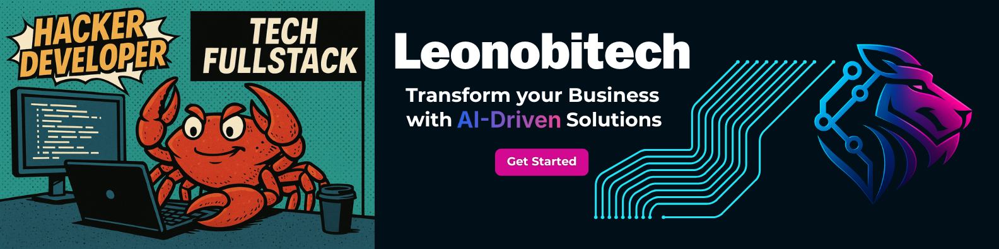

# fullstack-frontend-core

<p align="center">  </p>

Frontend foundation built with **Next.js 15 + TypeScript (ESM)** — containerized and ready to connect with the existing **Traefik infrastructure**.

A minimal “Hello World” app designed to run locally **as if it were in production**.

**FROM LOCALHOST TO PRODUCTION — BUILT LIKE A HACKER**

<p align="center"> <!-- Repo metrics --> <a href="https://github.com/leonobitech/fullstack-infrastructure-blueprint/stargazers">  </a> <a href="https://github.com/leonobitech/fullstack-infrastructure-blueprint/network/members">  </a> <a href="https://github.com/leonobitech/fullstack-infrastructure-blueprint/issues">  </a> <a href="https://github.com/leonobitech/fullstack-infrastructure-blueprint/blob/main/LICENSE">  </a>  <br/> <!-- Tech badges --> <a href="https://www.docker.com/">  </a> <a href="https://traefik.io/">  </a> <a href="https://github.com/FiloSottile/mkcert">  </a>  </p>

---

## 🧠 Overview

This repository represents the **frontend core** of the Leonobitech full-stack architecture.

It uses **Next.js 15 + TypeScript (ESM)**, runs in Docker, and is automatically discoverable by **Traefik** for HTTPS routing (`app.localhost` → frontend, `api.localhost` → backend).

It’s minimal by design — just enough to prove your infrastructure works **end-to-end**.

---

## 🧱 Stack

| Layer                   | Component               | Purpose                          |
| ----------------------- | ----------------------- | -------------------------------- |
| ⚛️ **Next.js 15**       | React framework         | SSR + static pages + API routes  |
| 🦾 **TypeScript (ESM)** | Modern language support | Type safety + cleaner DX         |
| 🐳 **Docker**           | Runtime isolation       | Production-like local execution  |
| ⚡ **Traefik 3.x**      | Reverse proxy           | HTTPS, domain routing            |
| 🔐 **mkcert**           | Local TLS               | Trusted local HTTPS certificates |

---

## 📦 Where this repo lives (root layout)

This project is designed to sit inside the same root alongside **infra** and **backend**:

```
root/
├─ assets/
├─ Docs/
│  ├─ README_BACKEND.md
│  └─ README_INFRA.md
├─ repositories/
│  ├─ core/          # backend (Node + TS + Hexagonal)
│  └─ frontend/      # <-- we will create this now
├─ traefik/
├─ .env
├─ .env.example
├─ docker-compose.yml
├─ docker-compose.local.yml
├─ docker-compose.prod.yml
├─ LICENSE
├─ Makefile
└─ README.md

```

---

## Create `repositories/frontend` and scaffold Next.js

From the **root** of your stack:

```bash
# 1) Ensure the parent folder exists
mkdir -p repositories
cd repositories

# 2) Create a Next.js app in "frontend"
#    (pick one: npm / pnpm / yarn)
npx create-next-app@latest frontend \
  --ts --eslint --app --src-dir false --tailwind \
  --use-npm --turbopack --import-alias "@/*"

# If you prefer pnpm:
pnpm dlx create-next-app@latest frontend \
  --ts --eslint --app --src-dir false --tailwind \
  --use-pnpm --turbopack --import-alias "@/*"

```

**Why this?**

- **App Router** and **ESM** by default.
- **Tailwind** ready out of the box.
- **Turbopack** for a faster dev server.
- Keeps the default alias **`@/*`** across the project.

---

### Initialize shadcn/ui

We prefer **CNA + shadcn init** (more control) over opinionated templates.

```bash
cd repositories/frontend

npx shadcn@latest init
```

- Select Base color: `zinc` or `slate` ( Optional )

### Add some base components:

```bash
npx shadcn@latest add button card input textarea select dialog sonner
```

## Replace the base page (Hello World)

**`app/layout.tsx`**

```tsx
import type { Metadata } from "next";
import { Geist, Geist_Mono } from "next/font/google";
import "./globals.css";

const geistSans = Geist({
  variable: "--font-geist-sans",
  subsets: ["latin"],
});

const geistMono = Geist_Mono({
  variable: "--font-geist-mono",
  subsets: ["latin"],
});

export const metadata: Metadata = {
  title: "Frontend Core — Leonobitech",
  description: "Next.js + TypeScript + Tailwind + shadcn/ui minimal core",
};

export default function RootLayout({
  children,
}: Readonly<{
  children: React.ReactNode;
}>) {
  return (
    <html lang="en">
      <body
        className={`${geistSans.variable} ${geistMono.variable} min-h-dvh bg-background text-foreground antialiased p-6`}
      >
        {children}
      </body>
    </html>
  );
}
```

**`app/page.tsx`**

```tsx
import { Button } from "@/components/ui/button";
import { Card, CardContent, CardHeader, CardTitle } from "@/components/ui/card";

export default function HomePage() {
  return (
    <main className="max-w-xl mx-auto grid gap-4">
      <h1 className="text-2xl font-semibold">🚀 Frontend Core — Hello World</h1>
      <Card>
        <CardHeader>
          <CardTitle>Stack</CardTitle>
        </CardHeader>
        <CardContent className="space-y-2">
          <p>Next.js 15 + TypeScript + Tailwind + Turbopack + shadcn/ui</p>
          <Button>It works</Button>
        </CardContent>
      </Card>
    </main>
  );
}
```

---

## Internal directory tree (after scaffold + shadcn)

```
repositories/frontend/
├─ public/
├─ src/app/
│      ├─ page.tsx
│      └─ layout.tsx
├─ .gitignore
├─ components.json
├─ eslint.config.mjs
├─ next-env.d.ts
├─ next.config.ts
├─ package.json
├─ postcss.config.mjs
├─ README.md
└─ tsconfig.json

```

---

## Run locally (without Docker)

From `repositories/frontend/`:

```bash
npm run dev
# visit http://localhost:3000
```

Build & start (prod mode, still without Docker):

```bash
npm run build && npm start
```

---

## Dockerize the frontend

Create a **Dockerfile** inside `repositories/frontend/`:

```docker
# --- Builder ---
FROM node:22-alpine AS builder
WORKDIR /app
ENV NEXT_TELEMETRY_DISABLED=1
COPY package*.json ./
RUN npm ci
COPY . .
RUN npm run build

# --- Runtime ---
FROM node:22-alpine AS runner
WORKDIR /app
ENV NODE_ENV=production
ENV NEXT_TELEMETRY_DISABLED=1

# curl para healthcheck
RUN apk add --no-cache curl

COPY --from=builder /app/package*.json ./
COPY --from=builder /app/node_modules ./node_modules
COPY --from=builder /app/.next ./.next
COPY --from=builder /app/public ./public

EXPOSE 3000
CMD ["npm", "run", "start"]
```

**`.dockerignore`**

```
node_modules
.next
.git
.gitignore
Dockerfile
README.md
.env
.env.*
*.log

```

---

## Recommended snippet (fast and no cache)

To make healthcheck faster and more stable, create a lightweight endpoint that always responds 200

```bash
// src/app/healthz/route.ts
export function GET() {
  return new Response("ok", {
    status: 200,
    headers: {
      "content-type": "text/plain; charset=utf-8",
      "cache-control": "no-store",
    },
  });
}
```

```bash
healthcheck:
  test: ["CMD-SHELL", "curl -fsS http://localhost:3000/healthz >/dev/null || exit 1"]
  interval: 15s
  timeout: 3s
  retries: 3
  start_period: 10s
```

## Add the service to your root `docker-compose.yml`

We’ll connect to the **same Traefik network** used by the rest of the stack (replace the network name if yours differs — e.g., `proxy` vs `leonobitech-net`). The example below assumes an external network named `leonobitech-net` and an `.env` with `FRONTEND_DOMAIN=app.localhost`.

```yaml
frontend:
  build:
    context: ./repositories/frontend
    dockerfile: Dockerfile
  image: frontend:v1.0.0
  container_name: frontend

  restart: unless-stopped

  environment:
    - NODE_ENV=production

  networks:
    - leonobitech-net

  depends_on:
    traefik:
      condition: service_started

  # 🔍 Healthcheck: using a lightweight endpoint
  healthcheck:
    test:
      [
        "CMD-SHELL",
        "curl -fsS http://localhost:3000/healthz >/dev/null || exit 1",
      ]
    interval: 15s
    timeout: 3s
    retries: 3
    start_period: 10s

  labels:
    - "traefik.enable=true"
    # HTTPS router: https://app.localhost
    - "traefik.http.routers.frontend.rule=Host(`${FRONTEND_DOMAIN}`)"
    - "traefik.http.routers.frontend.entrypoints=websecure"
    - "traefik.http.routers.frontend.tls=true"
    # Forward to container port 3000
    - "traefik.http.services.frontend.loadbalancer.server.port=3000"
    # Optionally attach middlewares defined under traefik/dynamic
    # - "traefik.http.routers.frontend.middlewares=secure-strict@file"
```

> Ensure your root .env contains:
>
> ```
> FRONTEND_DOMAIN=app.localhost
> ```

---

## Bring it up with Traefik

From the **root**:

```bash
docker compose up -d --build frontend
# or build the whole stack if Traefik is not up yet:
# docker compose up -d --build

# Options:
docker ps
docker logs -f frontend
```

Open:

- [**https://app.localhost**](https://app.localhost/) → Frontend Core
- [**https://traefik.localhost**](https://traefik.localhost/) → Dashboard (if enabled)

If you’re using **mkcert** from the infra repo, the cert will be trusted and the browser will show the lock icon.

---

## Troubleshooting

- **404 from Traefik** → Check labels and the **external network name**.
- **TLS warning** → Re-run mkcert and reload Traefik (see infra README).
- **Port conflict 3000** → Stop local `npm run dev` when testing the container.
- **Not using your host** → Confirm `.env FRONTEND_DOMAIN` and the router rule.

## 🧠 Philosophy

> “Production is not a deployment — it’s a mindset.”

This repository completes the local triad:

| Repo                                    | Role                                  |
| --------------------------------------- | ------------------------------------- |
| 🧱 `fullstack-infrastructure-blueprint` | Traefik + mkcert base                 |
| ⚙️ `fullstack-backend-core`             | API core (Node + Express + Hexagonal) |
| 🖥️ `fullstack-frontend-core`            | Frontend (Next.js + TypeScript)       |

Together, they simulate a **real production-grade full stack**, entirely on your laptop.

---

## 🔗 Verify Full Stack

```bash
docker compose up -d --build traefik core frontend
```

After all three repos are up:

- `https://traefik.localhost` → Traefik dashboard
- `https://api.localhost` → Backend core
- `https://app.localhost` → Frontend core

✅ Everything runs locally under HTTPS — just like in production.

---

## 🪐 Tags

`frontend`, `nextjs`, `typescript`, `esm`, `docker`, `traefik`, `mkcert`, `production-like`, `leonobitech`, `fullstack`, `infrastructure`

---

## 📜 License

MIT © 2025 — Felix Figueroa @ Leonobitech

---

<p align="center"> <strong>🥷 Leonobitech Dev Team</strong><br/> <a href="https://www.leonobitech.com" target="_blank">https://www.leonobitech.com</a><br/> Made with 🧠, 🥷, and Docker love 🐳 </p>

---

🔥 *This isn’t just a frontend. It’s your bridge between infrastructure and imagination.*
